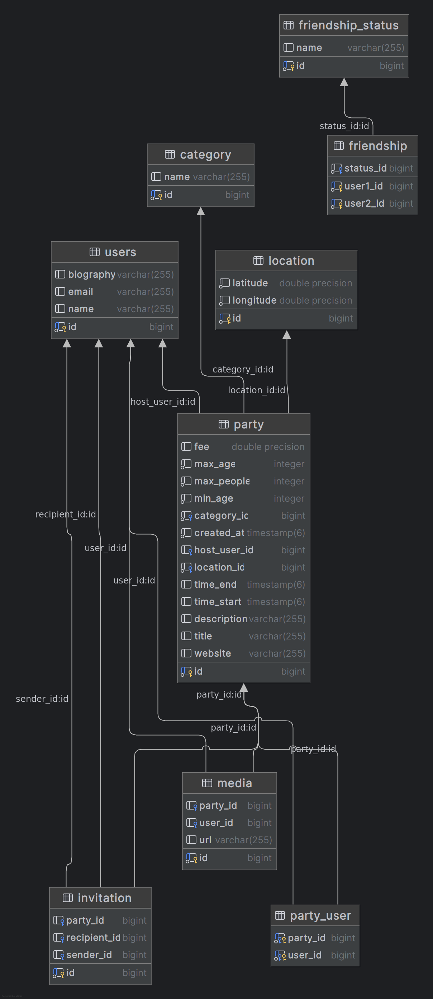

# PartyHub

## Sprint Review Dates
1. Sprint: 08.10.2025
2. Sprint: 05.11.2025
3. Sprint: 19.11.2025

## Run Locally

Clone the project

```bash
  git clone git@github.com:htl-leo-itp-25-27-4-5BHITM/Partyhub.git
```

Go to the project directory

```bash
  cd Partyhub
```

Run maven installs

```bash
  ./mvnw clean install
```

Start the server

```bash
  docker-compose up
```

Open the Website in your Browser

```bash
  http://localhost::8080
```

## API Reference

#### Test Backend connection

```http
  GET /api/
```

## Screenshots


