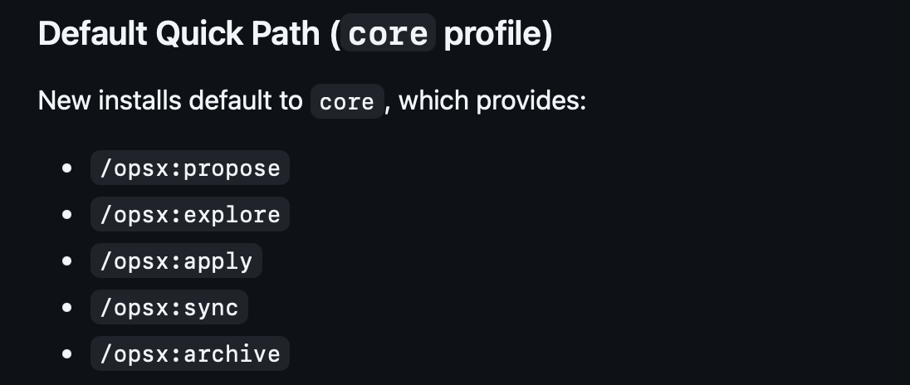

# PartyHub

<p align="center">
  
</p>
<p align="center">
  <a href="https://github.com/htl-leo-itp-25-27-4-5BHITM/Partyhub/actions/workflows/deploy.yml"></a>
</p>


A social event platform for organizing and discovering parties, meetups, and social gatherings.

## Features

- **User Management**: Keycloak registration and login (browser and iOS), profiles with pictures and biographies
- **Event Creation**: Hosts create public or private parties with details, a theme and a location
- **Social Features**: Follow requests, mutual contacts, private-party invitations, joining and leaving parties
- **Media Sharing**: Party galleries for party viewers
- **Location-Based**: Parties on a map with coordinates and addresses; the iOS map filters by distance using the device location locally
- **Age and Capacity Info**: Minimum/maximum age and capacity are shown and filterable; they do not block joining

The accepted product behaviour is specified in [`openspec/specs/`](openspec/specs/); the evidence, decisions and open gaps are in [`docs/openspec-baseline/`](docs/openspec-baseline/runbook.md).

## Tech Stack

- **Backend**: Quarkus 3.28.2 (Java 21)
- **Database**: PostgreSQL with Hibernate ORM
- **Authentication**: Keycloak (Authorization Code + PKCE) with SmallRye JWT bearer validation
- **Clients**: static browser app (`src/main/resources/META-INF/resources/`) and a SwiftUI iOS app (`PartyHubiOS/`)
- **Documentation**: Swagger UI for API exploration

## Installation

### 1. Clone the repository

```bash
git clone git@github.com:htl-leo-itp-25-27-4-5BHITM/Partyhub.git
cd Partyhub
```

### 2. Setup local development
```bash
./deploy-local.sh
```

`deploy-local.sh` **deletes the local Docker volumes** (`docker-compose down -v`, including the local Keycloak database), starts Postgres and Keycloak, builds the project (running the tests) and starts `./mvnw quarkus:dev`. In dev mode the application schema is dropped, recreated and filled from `import.sql` on every start, and the `X-User-Id` test bypass is enabled; do not rely on it to verify real login.
### 3. Sync import.sql to Local and Server DB

If you change seed data in `src/main/resources/import.sql`, apply it with the script below. `import.sql` starts with `TRUNCATE ... CASCADE`, so **every target database is emptied and reseeded**. The default targets both local and Kubernetes databases; use `--local-only` unless you really want to reset the school-cloud data.

```bash
./sync-import.sh
```

This updates:
- local docker-compose Postgres (`postgres` service)
- Kubernetes Postgres pod (`app=postgres`, namespace `default`)

Common variants:

```bash
# only local DB
./sync-import.sh --local-only

# only Kubernetes DB
./sync-import.sh --k8s-only --namespace default
```

Requirements:
- local sync: `docker compose` (or `docker-compose`) and running `postgres` service
- server sync: `kubectl` access to the cluster and namespace

### 4. Open the application

**Website**: http://localhost:8080

**API Documentation**: http://localhost:8080/q/swagger-ui/

### 5. Local Keycloak login

Keycloak runs at http://localhost:8000 and imports the `partyhub` realm from
`keycloak/realm-dev.json` (`keycloak/realm-staging.json` is the realm baked into
the deployment image). Keycloak admin console: bootstrap user `admin` / `admin`.

Local demo users (password = username), for example:

```text
Username: viki_vej
Password: viki_vej
```

Each demo user matches exactly one seeded PartyHub user (seed users are stored
without a Keycloak ID) and is linked on first login. If the `frontend` client
or demo users do not appear after changing `realm-dev.json`, recreate the local
Postgres volume or delete and re-import the `partyhub` realm, because Keycloak
only imports a realm that does not exist yet.

## Production

**Website**: https://it220274.cloud.htl-leonding.ac.at

A push to `main` runs the `Test` → `Build and Push` → `Deploy` workflows. The
accepted contract ([`deployment-environment`](openspec/specs/deployment-environment/spec.md))
requires deployments to keep all data. **The current `deploy.yml` does not meet
it yet:** it drops the shared `demo` schema (application and Keycloak data) and
replays `import.sql` on every deploy (gap G057 in
[`docs/openspec-baseline/gaps.md`](docs/openspec-baseline/gaps.md)).

## Project Structure

```
Partyhub/
├── src/main/java/at/htl/      # Backend, one package per domain:
│   ├── auth/ config/ user/ follow/ party/ invitation/
│   ├── media/ notification/ notificationsettings/
│   ├── location/ user_location/ profile_picture/ qr/ validation/
├── src/main/resources/
│   ├── META-INF/resources/    # Browser app (HTML/JS/CSS)
│   ├── application.properties # Profiles: dev, staging, prod
│   └── import.sql             # Seed data
├── src/test/                  # JUnit/RestAssured tests (H2)
├── api/                       # HTTPYac API tests
├── PartyHubiOS/               # SwiftUI iOS app
├── keycloak/                  # Realm files and PartyHub theme
├── k8s/                       # School-cloud manifests
├── openspec/                  # Specifications and changes
├── docs/openspec-baseline/    # Specification evidence and handoff
├── docker-compose.yaml        # Local Postgres + Keycloak
└── deploy-local.sh / sync-import.sh / run-http-tests.sh
```

## Running Tests

```bash
mvn clean test
```

Code coverage is generated using **JaCoCo**.

After tests complete, view the HTML coverage report at:

```
target/jacoco-report/index.html
```

## Building the Project

```bash
mvn clean package
```

## API Reference

Authentication is handled by Keycloak; clients read the issuer from
`GET /api/config/public` and send bearer tokens. The REST API has 58 endpoints:

- **Users and profiles**: `/api/users/*` (profiles, `/me`, profile pictures, followers/following and follow requests under `/api/users/{id}/...`)
- **Notification settings**: `/api/users/{id}/notification-settings`
- **Parties**: `/api/parties/*` (CRUD, join/leave, members, invitation stats, party media under `/api/parties/{id}/media`)
- **Invitations**: `/api/invitations/*`
- **Notifications**: `/api/notifications/*`
- **QR login**: `/api/qr/*` (deferred prototype, not a supported login)

The complete method/path/status list is in
[`docs/openspec-baseline/api-contract-matrix.md`](docs/openspec-baseline/api-contract-matrix.md);
the live OpenAPI document is served at `/q/openapi` (the root `openapi.yaml` is outdated).
### Codex commands


## Sprint Review Dates

1.  Sprint: 08.10.2025
2.  Sprint: 05.11.2025
3.  Sprint: 19.11.2025
4.  Sprint: 03.12.2025
5.  Sprint: 17.12.2025
6.  Sprint: 14.01.2026
7.  Sprint: 28.01.2026
8.  Sprint: 11.02.2026
9.  Sprint: 04.03.2026
10. Sprint: 18.03.2026
11. Sprint: 08.04.2026
12. Sprint: 29.04.2026
13. Sprint: 13.05.2026
