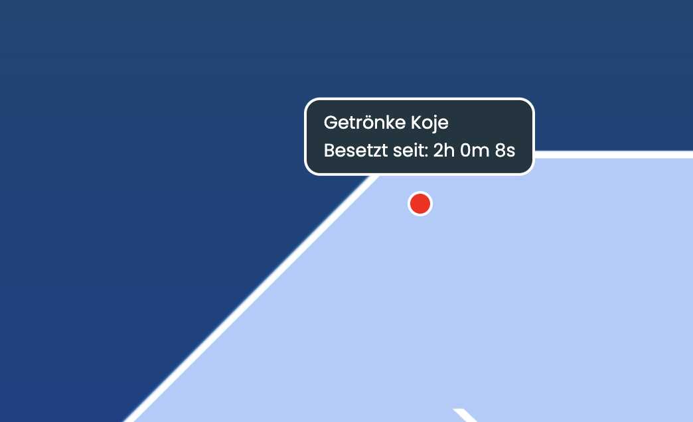
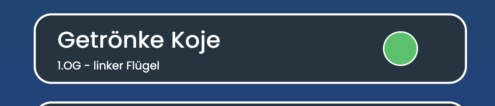
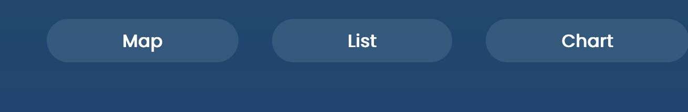
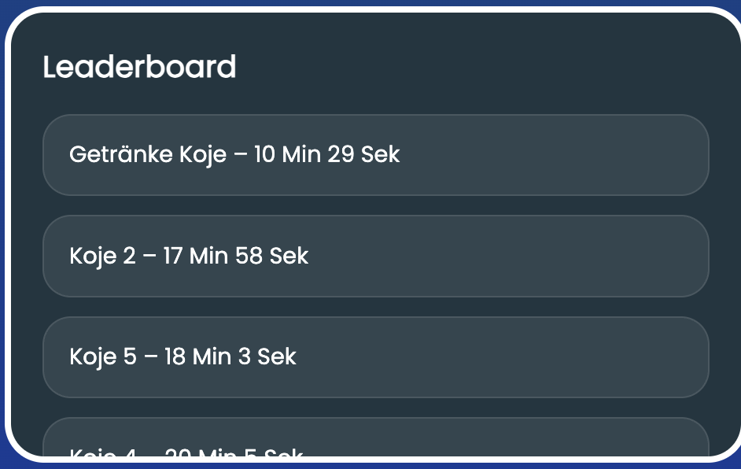
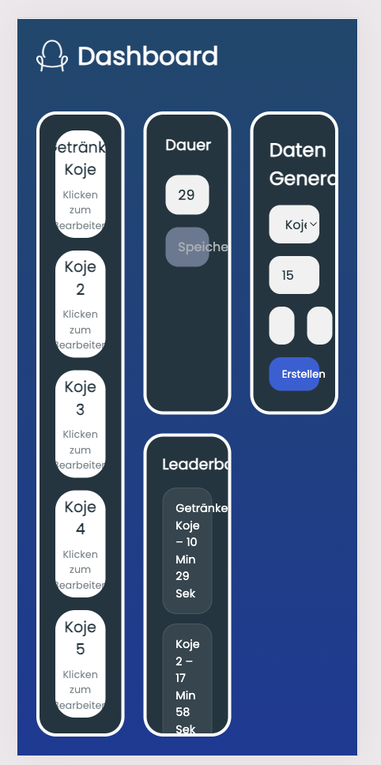
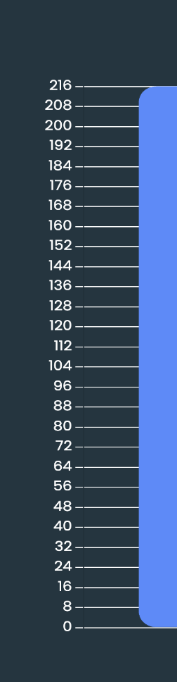
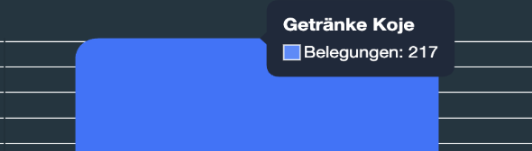
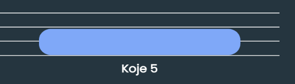
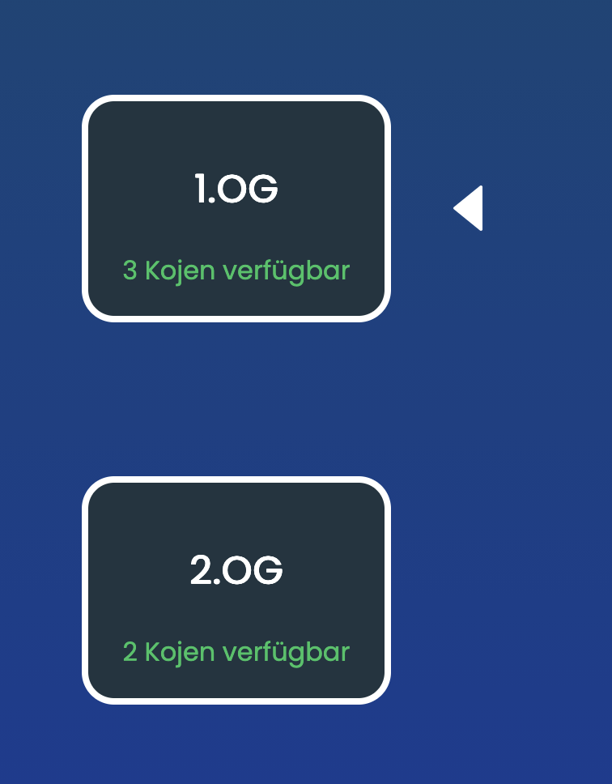

# SmartSeat Testen

Protokoll zum Testen von SmartSeat

**Datum:** 24.06.2026
**Tester:innen:** Anna Reder, Carla Dimmler, Martin Briefeneder, Viktora Vejmelek

---

## Übersicht

| Nr. | Thema | Bereich | Author |
|---:|---|---|---|
| 1 | Dauer der Kojen-Sitzung | Dashboard & Daten | Anna Reder |
| 2 | Rechtschreibung „Getränke Koje“ | Texte & Benennung | Carla Dimmler |
| 3 | Titel „Map“ statt „Dashboard“ | Texte & Benennung | Carla Dimmler |
| 4 | Zugang zum Dashboard-Login | Navigation | Martin Briefeneder |
| 5 | Speichern ohne Namensänderung | Kojen verwalten | Martin Briefeneder |
| 6 | Einheit bei der Dauer | Kojen verwalten | Anna Reder, Martin Briefeneder |
| 7 | Verständlichkeit des Dashboards | Dashboard & Daten | Anna Reder |
| 8 | Scrollen im Leaderboard | Layout & Responsive | Viktoria Vejmelek |
| 9 | Einheitliches Responsive Design | Layout & Responsive | Anna Reder |
| 10 | Bedeutung der Zahlen | Dashboard & Daten | *nicht angegeben* |
| 11 | Aktive Seite in der Navigation | Navigation | Anna Reder |
| 12 | Werte im Chart sichtbar | Dashboard & Daten | Viktoria Vejmelek |
| 13 | Pfeil zur Ebenen-Auswahl | Interaktion | Carla Dimmler |

---

## Test 1 – Dauer der Kojen-Sitzung

| | |
|---|---|
| **Datum** | 24.06.2026 |
| **Erwartetes Ergebnis** | Neue Kojen-Sitzung, anfangend bei 0 |
| **Tatsächliches Ergebnis** | Schon seit 2 h besetzt |
| **Author** | Anna Reder |

> **Bemerkung:** Ich will sehen, wie lange jemand schon drinnen ist, um ca. eine Einschätzung zu haben, wann sie gehen könnten.

---

## Test 2 – Rechtschreibung „Getränke Koje“

| | |
|---|---|
| **Datum** | 24.06.2026 |
| **Erwartetes Ergebnis** | Getränke Koje |
| **Tatsächliches Ergebnis** | Getrönke Koje |
| **Author** | Carla Dimmler |

> **Bemerkung:** Rechtschreibfehler

---

## Test 3 – Titel „Map“ statt „Dashboard“

| | |
|---|---|
| **Datum** | 24.06.2026 |
| **Erwartetes Ergebnis** | Dashboard – ? |
| **Tatsächliches Ergebnis** | Map |
| **Author** | Carla Dimmler |

> **Bemerkung:** Statt „Map“ eher als „Dashboard“ betiteln.

---

## Test 4 – Zugang zum Dashboard-Login

| | |
|---|---|
| **Datum** | 24.06.2026 |
| **Erwartetes Ergebnis** | Man kommt zum Dashboard-Login über einen Button auf der Website. |
| **Tatsächliches Ergebnis** | Man muss den Pfad `dashboard.html` manuell eingeben, damit man zum Login und dann zum Dashboard kommt. |
| **Author** | Martin Briefeneder |

> **Bemerkung:** Eventuell könnte man über das Logo oben links zum Login bzw. Dashboard kommen.

---

## Test 5 – Speichern ohne Namensänderung

| | |
|---|---|
| **Datum** | 24.06.2026 |
| **Erwartetes Ergebnis** | Das Abspeichern des Namens einer Koje funktioniert unabhängig davon, ob der Titel geändert wurde. |
| **Tatsächliches Ergebnis** | Beim Speichern ohne Ändern des Namens („Koje 2“ umbenennen auf „Koje 2“) erscheint: **„Fehler beim Umbenennen“** |
| **Author** | Martin Briefeneder |

> **Bemerkung:** Man könnte den „Abbrechen“-Button entfernen und nur einen „Speichern“-Button haben. Das wirkt intuitiver für den User.

---

## Test 6 – Einheit bei der Dauer

| | |
|---|---|
| **Datum** | 24.06.2026 |
| **Erwartetes Ergebnis** | Zeitangabe bei Dauer!!! Minuten, Stunden, Sekunden, Feigen oder Zwetschken? |
| **Tatsächliches Ergebnis** | Nix |
| **Author** | Anna Reder, Martin Briefeneder |

> **Bemerkung:** Bitte eine Zeitangabe, sonst weiß man nicht, was man da jetzt wirklich setzt.

---

## Test 7 – Verständlichkeit des Dashboards

| | |
|---|---|
| **Datum** | 24.06.2026 |
| **Erwartetes Ergebnis** | Selbsterklärendes Dashboard |
| **Tatsächliches Ergebnis** | Daten-Generator, der für alle außerhalb vom Projekt nicht verständlich ist. |
| **Author** | Anna Reder |

> **Bemerkung:** Bitte macht alles so, dass man auf einen Blick weiß, was man macht.

---

## Test 8 – Scrollen im Leaderboard

| | |
|---|---|
| **Datum** | 24.06.2026 |
| **Erwartetes Ergebnis** | Scrollen im Leaderboard, um auch bei kleinen Laptops etwas lesen zu können. |
| **Tatsächliches Ergebnis** | Man sieht nur die Hälfte, oder mehr oder weniger, das weiß man nicht. |
| **Author** | Viktora Vejmelek |

> **Bemerkung:** –

---

## Test 9 – Einheitliches Responsive Design

| | |
|---|---|
| **Datum** | 24.06.2026 |
| **Erwartetes Ergebnis** | Responsive Design überall oder gar nicht |
| **Tatsächliches Ergebnis** | Responsive Design nur auf den Nicht-Dashboard-Seiten |
| **Author** | Anna Reder |

> **Bemerkung:** –

---

## Test 10 – Bedeutung der Zahlen

| | |
|---|---|
| **Datum** | 24.06.2026 |
| **Erwartetes Ergebnis** | Eine klare Darstellung |
| **Tatsächliches Ergebnis** | Irgendwelche Zahlen, die vielleicht keinen Sinn ergeben |
| **Author** |  |

> **Bemerkung:** Es wäre schön, wenn man weiß, wofür die Zahlen stehen.

---

## Test 11 – Aktive Seite in der Navigation

| | |
|---|---|
| **Datum** | 24.06.2026 |
| **Erwartetes Ergebnis** | Man sieht, wo man sich gerade in der Navigation befindet. |
| **Tatsächliches Ergebnis** | Leider keine richtige Ansicht bei der Navigation |
| **Author** | Anna Reder |

> **Bemerkung:** –

---

## Test 12 – Werte im Chart sichtbar

| | |
|---|---|
| **Datum** | 24.06.2026 |
| **Erwartetes Ergebnis** | Bei großen Unterschieden sieht man die Info beim Chart trotzdem überall. |
| **Tatsächliches Ergebnis** | Man kann nur über einen Chart drüber hovern und das Ergebnis sehen. |
| **Author** | Viktoria Vejmelek |

> **Bemerkung:** –

---

## Test 13 – Pfeil zur Ebenen-Auswahl

| | |
|---|---|
| **Datum** | 24.06.2026 |
| **Erwartetes Ergebnis** | Man glaubt, dass man etwas mit dem Pfeil machen muss (User Experience). |
| **Tatsächliches Ergebnis** | Keine Funktionalität. Wenn man auf die andere Ebene klickt, geht der Pfeil auf die andere Ebene. |
| **Author** | Carla Dimmler |

> **Bemerkung:** Als User würde ich eher verstehen, dass der Pfeil eine Funktionalität hat.
> Ich würde es eventuell so veranschaulichen, dass der Rahmen der Ebene grün umrandet ist und somit „aktiv“ andeutet. Wenn ich auf die andere Ebene klicke, sollte dort der Rahmen grün sein.

